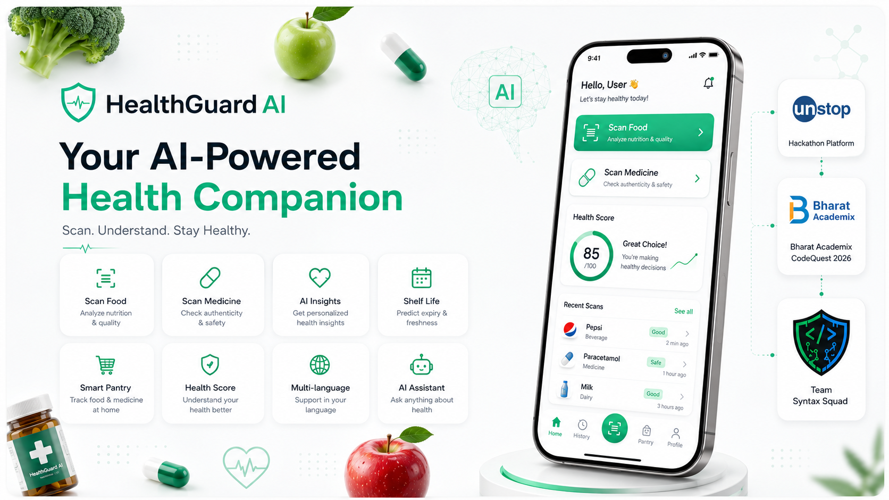
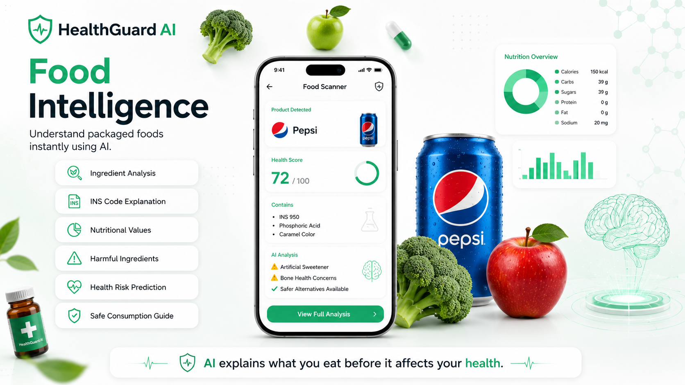
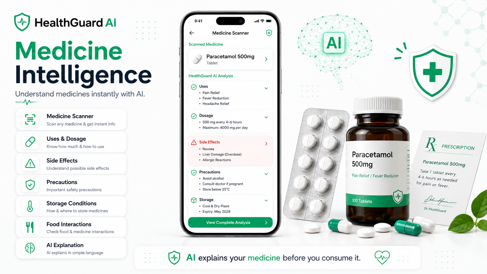
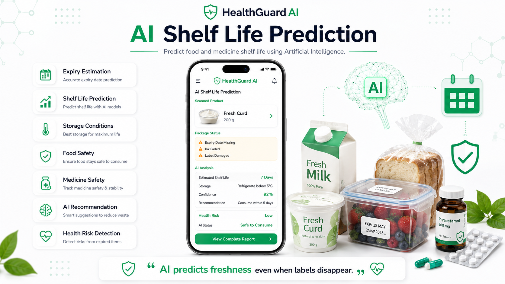
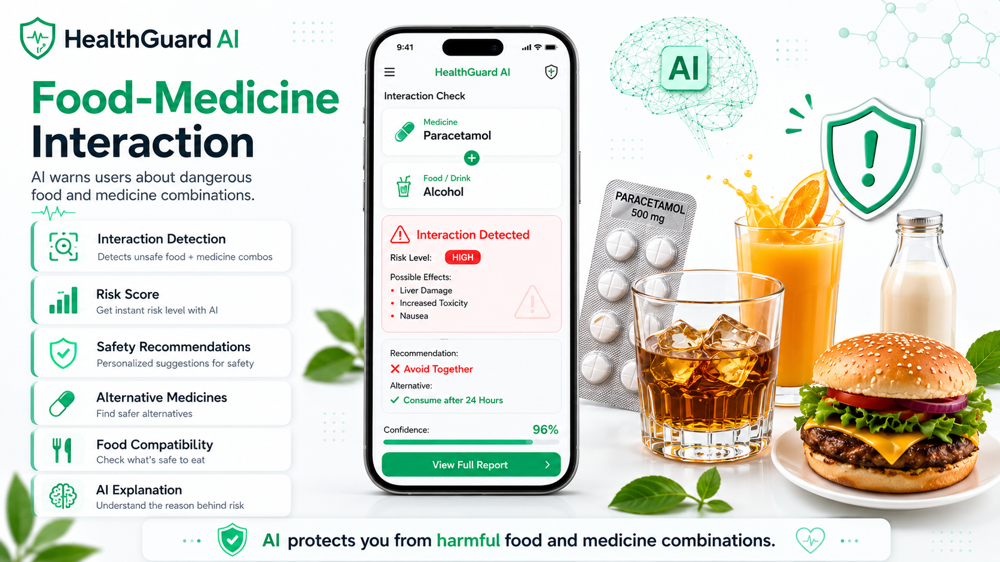
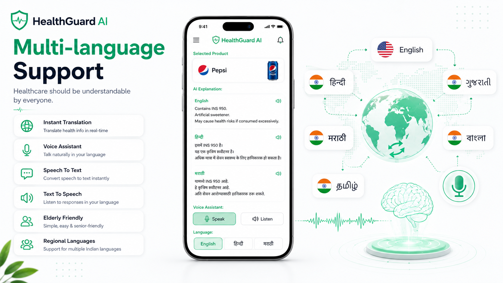
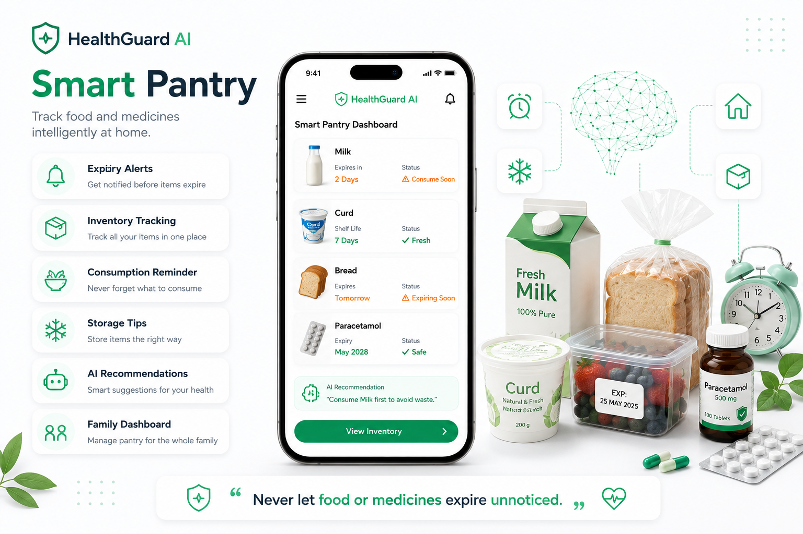
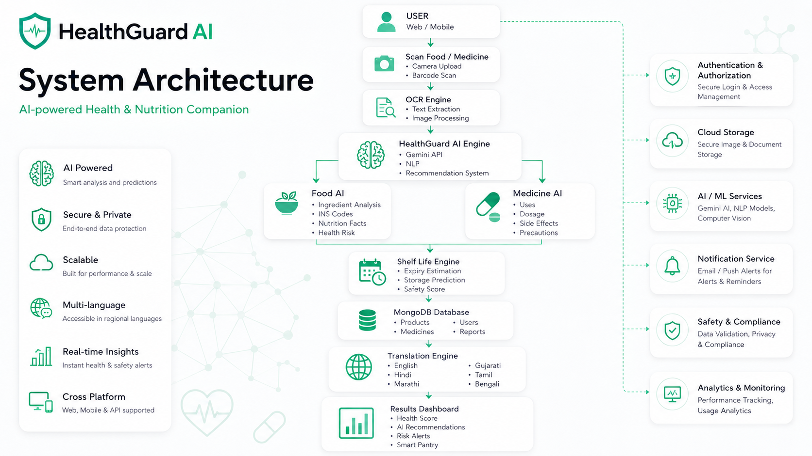

<div align="center">
<<<<<<< HEAD

</div>

# Run and deploy your AI Studio app

This contains everything you need to run your app locally.

View your app in AI Studio: https://ai.studio/apps/7f44944b-e71f-457b-8f46-f220738c3ed5

## Run Locally

**Prerequisites:**  Node.js


1. Install dependencies:
   `npm install`
2. Set the `GEMINI_API_KEY` in [.env.local](.env.local) to your Gemini API key
3. Run the app:
   `npm run dev`
=======

# 🩺 HealthGuard AI

<p align="center">
  
</p>

## 🤖 AI-powered Health & Nutrition Companion

### SCAN. UNDERSTAND. STAY HEALTHY.

🏆 Built for Bharat Academix CodeQuest Hackathon 2026

---

### 👨‍💻 Team : Syntax Squad

| Name | Role |
|------|------|
| 👑 Sachin Sharma | Team Leader |
| 💻 Siddesh Mange | Team Member |

</div>

---

# 📌 About The Project

HealthGuard AI is an AI-powered healthcare and nutrition assistant that helps users understand food products, medicines, shelf life, and health risks instantly.

The project combines:

- 🥗 Food Intelligence
- 💊 Medicine Intelligence
- 📅 AI Shelf Life Prediction
- 🔄 Food-Medicine Interaction
- 🌍 Multi-language Support
- 📦 Smart Pantry
- 🤖 AI Assistant
- 📊 Health Score

Our mission is to make healthcare information:

✅ Easy to Understand

✅ Accessible to Everyone

✅ AI Powered

✅ Multi-language

✅ Fast and Reliable

---

# 🚀 Key Features

### 🥗 Food Intelligence

- Ingredient Detection
- OCR Label Reading
- Harmful Ingredient Detection
- Nutritional Information
- Health Score
- Safe Consumption Guide
- AI Explanation
- Safer Alternatives

<p align="center">

</p>

---

### 💊 Medicine Intelligence

- Medicine Scanner
- Uses & Dosage
- Side Effects
- Precautions
- Food Interactions
- Storage Conditions
- AI Explanation

<p align="center">

</p>

---

### 📅 AI Shelf Life Prediction

HealthGuard AI predicts food and medicine shelf life using AI.

Features:

- Shelf Life Prediction
- Expiry Estimation
- Storage Suggestions
- Food Safety
- Medicine Safety
- Freshness Score
- AI Recommendations

<p align="center">

</p>

---

### 🔄 Food-Medicine Interaction

Get alerts about dangerous food and medicine combinations.

Features:

- Interaction Detection
- Risk Score
- Safety Recommendations
- Alternative Medicines
- Alternative Foods
- AI Explanation

<p align="center">

</p>

---

### 🌍 Multi-language Support

Healthcare should be understandable by everyone.

Supported Languages:

- 🇺🇸 English
- 🇮🇳 हिन्दी
- 🇮🇳 मराठी
- 🇮🇳 ગુજરાતી
- 🇮🇳 தமிழ்
- 🇮🇳 বাংলা

Features:

- Instant Translation
- Voice Assistant
- Speech To Text
- Text To Speech
- Elderly Friendly UI

<p align="center">

</p>

---

### 📦 Smart Pantry

Track food and medicines at home.

Features:

- Expiry Alerts
- Storage Tips
- Consumption Reminder
- Inventory Tracking
- AI Recommendations
- Health Tracking

Track:

🥛 Milk

🍞 Bread

🥣 Curd

💊 Medicines

<p align="center">

</p>

---

# 🏗️ System Architecture

The system flow:

```text
User
   ↓
Scan Food / Medicine
   ↓
OCR Engine
   ↓
HealthGuard AI Engine
   ↓
Food Analysis
Medicine Analysis
Shelf Life Prediction
Health Score
   ↓
MongoDB Database
   ↓
Translation Engine
   ↓
Results Dashboard
```

<p align="center">

</p>

---

# 🛠️ Tech Stack

### Frontend

- HTML5
- CSS3
- JavaScript
- React.js
- Tailwind CSS

### Backend

- Node.js
- Express.js

### AI / ML

- Google Gemini API
- OCR Engine
- NLP
- Image Processing

### Database

- MongoDB

### Tools

- Git
- GitHub
- VS Code
- Figma
- Stitch AI

---

# 📸 Screenshots

### Homepage

<p align="center">

</p>

### Food Intelligence

<p align="center">

</p>

### Medicine Intelligence

<p align="center">

</p>

### Shelf Life Prediction

<p align="center">

</p>

### Multi-language Support

<p align="center">

</p>

---

# 👥 Team

## 👑 Sachin Sharma

### Team Leader

- Project Management
- Backend Development
- AI Integration
- System Architecture

---

## 💻 Siddesh Mange

### Team Member

- Frontend Development
- UI / UX Design
- Documentation
- Testing

---

# 🏆 Bharat Academix CodeQuest Hackathon 2026

HealthGuard AI is proudly developed by **Syntax Squad** for the **Bharat Academix CodeQuest Hackathon 2026**.

Our vision:

> Make healthcare information understandable, accessible and intelligent for everyone.

---

<div align="center">

# 🩺 HealthGuard AI

### SCAN. UNDERSTAND. STAY HEALTHY.

Made with ❤️ by **Syntax Squad**

</div>
>>>>>>> 8617e76f91ec74e34cb3cf321e7df64f20e36e9a
